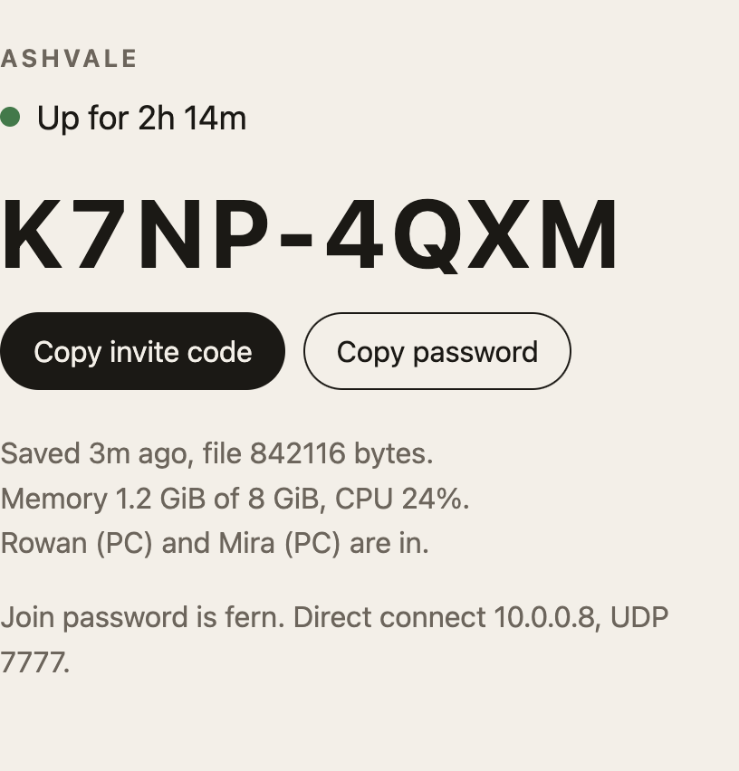

# rsdw-status



See whether a [RuneScape: Dragonwilds dedicated server](https://github.com/runescape/rsdw-dedicated) is up, and copy the current invite code, without opening the game.

> [!NOTE]
> Unofficial. This is not a Jagex project, and it is not part of the official image.

## Start

The game server has to be running in Docker already.

1. Set `RSDW_DATA_DIR` to the host folder that the game container mounts at `/home/steam/rsdw-dedicated`.
2. Start this page.

```bash
export RSDW_DATA_DIR=/path/to/rsdw-dedicated
docker compose up -d
```

Open [http://127.0.0.1:8791](http://127.0.0.1:8791).

## What you see

- A green or red dot, and how long the container has been up.
- The invite code, large, with a copy button. It is the latest `JoinCode` line in `RSDragonwilds.log`. A new code is written every time the game server starts. The copy button stays off until the log says the session is ready to join.
- How long ago the world last saved. The dedicated server saves about every five minutes. If `SaveGames` is mounted, the page also shows the save-file size, and says if that size has not changed for 10 minutes. If the server is up and the last success is older than 10 minutes, the page says the save looks stale.
- Who is in, each on their own line with platform and how long they have been in. A leave names the player when the log includes the same account id as the login.
- A short activity feed: joins, leaves, saves, chest opens, craft recipes, and the latest shrine or NPC line from the log. Station “clearing” lines on world load are ignored.
- Chest respawn countdowns from `LogChests`, when the log has them. This is a list, not a map.
- Memory and CPU for the game container. Network totals are omitted; on a host-network server Docker reports those as zero.
- The page title is the world name from `DefaultWorldName` (what people search in the Worlds browser). The meta line shows `Created by` from `ServerName`.
- The dedicated-server Steam build id from `steamapps/appmanifest_4019830.acf`, and a warning when Valve says that build is behind. Friends often cannot join when the client updated and the dedicated image has not.
- A red warning when a client connects with a different network version than the server (`invalid version` in the log). After five minutes the page restarts the game container so SteamCMD can pull the new build. The invite code changes on that restart. Restarts are limited to once every 30 minutes.
- A warning when the container log says a new Steam version is available and the server is stopping. That restart writes a new invite code.
- The join password from `WorldPassword` in `DedicatedServer.ini`, with a copy button. If the world has no password, the button stays off.
- When nobody is in, a short flavor line named after a classic RuneScape place.

It does **not** show which zone someone is standing in. The dedicated log has fog-of-war region unlocks (`LogMapRegions`), not a live zone feed — see [docs/live-zone.md](docs/live-zone.md). Hillwilds runs with `DEBUG=3` so we keep maximum logging on.

Set `RSDW_DIRECT_HOST` if you also want a direct-connect address on the page. Leave it empty and that line is omitted.

## Keep it on your network

> [!WARNING]
> Anyone who can open this page can see the invite code and the join password. It listens on localhost only. If you change `compose.yaml` so other computers on your LAN can open it, do not forward that port on your router.

The container mounts the Docker socket, so it can control Docker, not only read one container. Run it on a machine you trust.

`DedicatedServer.ini` also contains the admin password. This page does not show it.

## Settings

| Variable | Default | What it does |
| --- | --- | --- |
| `RSDW_DATA_DIR` | | Host path of the game data. Compose only. Required. |
| `RSDW_CONTAINER` | `rsdw-dedicated` | Container to inspect |
| `RSDW_STATUS_PORT` | `8791` | Port the page binds inside the container. Keep it the same as the published port. |
| `RSDW_DIRECT_HOST` | empty | Direct-connect address. Hidden when empty. |
| `RSDW_GAME_PORT` | `7777` | Game port shown next to that address |

Compose mounts the game log at `/logs/RSDragonwilds.log`, the save files at `/saves`, the ini at `/config/DedicatedServer.ini`, and `steamapps` at `/steamapps` for the build id. The save and steamapps mounts are optional. If either is missing, the page omits that fact.

## Just the invite code

```bash
docker logs rsdw-dedicated 2>&1 | awk '/JoinCode/{line=$0} END{print line}'
```

## Record a session

`watch-logs.py` polls every 30 seconds and does not change the server. Read `summary.md` for who is in, the last save, the invite code, and whether the UDP ports are listening. `events.log` has one line per join, leave, save, invite-code change, and the first time each error appears. `gamelog.log` keeps the raw log without profanity-filter lines.

Set `RSDW_SSH_HOST`, `RSDW_LOG`, and `RSDW_SAV_DIR`. Optional `RSDW_RECORD_DIR` chooses the output folder. Output is gitignored.
